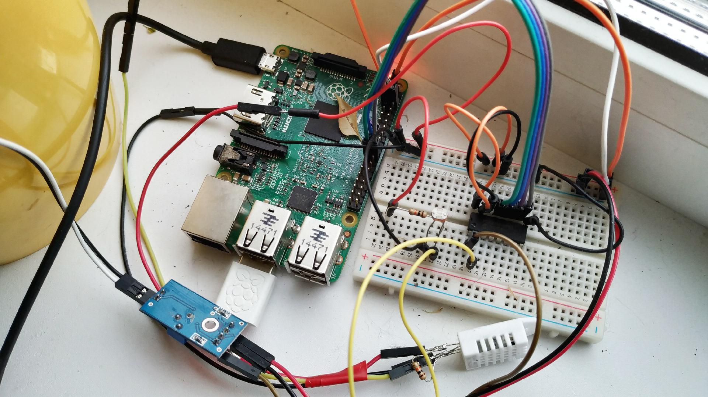
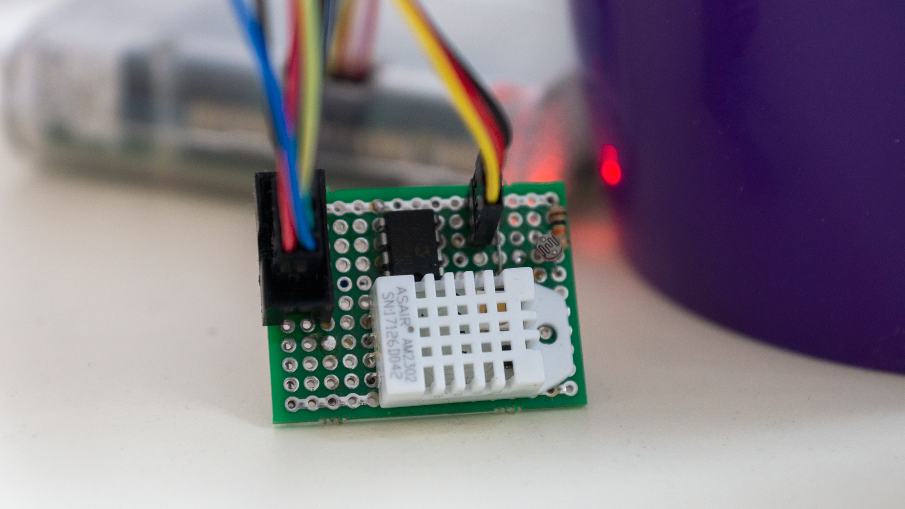
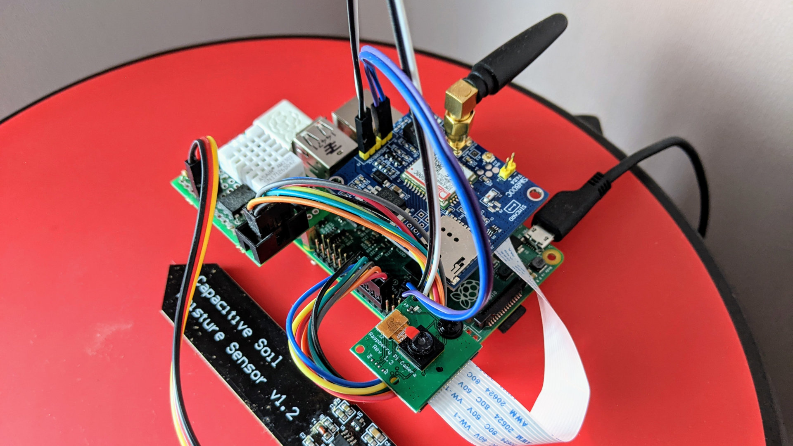

Apollo IoT module
====

  

About
----

Raspberry Pi monitoring app, a satellite for [Helios app](https://github.com/manti-by/helios)

Author: Alexander Chaika <manti.by@gmail.com>

Source link: https://github.com/manti-by/apollo/

Requirements:

- Raspberry Pi 2 Model B
- MCP3002 AD converter (MCP3008 in v1)
- Soil Moisture sensor
- Light sensor
- DHT22 sensor
- Camera Module OV5647 (new in v3)
- GSM Module SIM800C (new in v3)

Alpha version
----

Beta version
----

First release candidate
----

Setup Apollo application
----

1. Install python3.8, pip, virtualenv and sqlite3

        $ sudo apt install -y python-pip virtualenv sqlite3

2. Create and activate virtualenv

        $ virtualenv -p python3 --prompt=apollo- /home/pi/apollo/venv
        $ source /home/pi/apollo/venv/bin/activate

3. Clone sources and install pip packages

        $ mkdir /home/pi/apollo/ && cd /home/pi/apollo/
        $ git clone https://github.com/manti-by/apollo.git src
        $ pip install -r src/requirements/dev.txt

4. Install crontabs

        */5 * * * *    cd /home/pi/apollo/src/ && /home/pi/apollo/venv/bin/python -m apollo.sensors
        2-59/5 * * * * raspistill -o /home/pi/apollo/data/photo/$(date +\%Y-\%m-\%d_\%H-\%M-\%S).jpg
        4-59/5 * * * * cd /home/pi/apollo/src/ && /home/pi/apollo/venv/bin/python -m apollo.proxy
        0 * * * *      find /home/pi/apollo/data/photo -name '*.jpg' -type f -mmin +480 -delete

Setup Helios application
----

Please check [README.md](https://github.com/manti-by/helios/blob/master/README.md) in Helios repository
for more details.

Notes
----

Install locally DHT library on non Raspberry Pi device

        $ pip install --install-option="--force-pi" Adafruit_DHT
