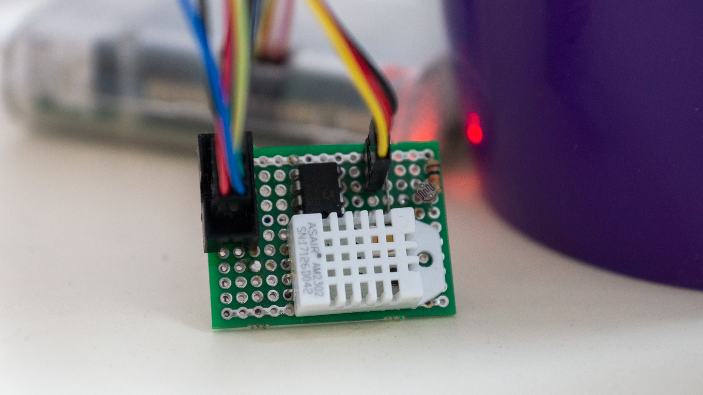

Apollo IoT App
====

  

About
----

Raspberry Pi monitoring app

Author: Alexander Chaika <manti.by@gmail.com>

Source link: https://github.com/manti-by/Apollo/

Requirements:

- Raspberry Pi
- MCP3002 AD converter (v1 - MCP3008)
- Soil Moisture sensor
- Light sensor
- DHT22 sensor

First version
----

Second version
----

Setup
----

1. Install python pip

        $ sudo apt install python-pip sqlite3 supervisor

2. Install, create and activate virtualenv

        $ sudo pip install virtualenv
        $ virtualenv -p python3 --no-site-packages --prompt=apollo- venv
        $ source venv/bin/activate

3. Clone sources and install pip packages

        $ mkdir apollo/ && cd apollo/
        $ git clone https://github.com/manti-by/Apollo.git src
        $ pip install -r src/app/requirements.txt
    
4. Run flask server under supervisor

        $ sudo ln -s /home/pi/apollo/src/svctl.conf /etc/supervisorctl/conf.d/apollo.conf
        $ sudo supervisorctl update

5. Install worker crontab

        */5 * * * *    /home/pi/apollo/venv/bin/python /home/pi/apollo/src/app/worker.py

Notes
----

Install locally DHT library on non Raspberry Pi device

        $ pip install --install-option="--force-pi" Adafruit_DHT